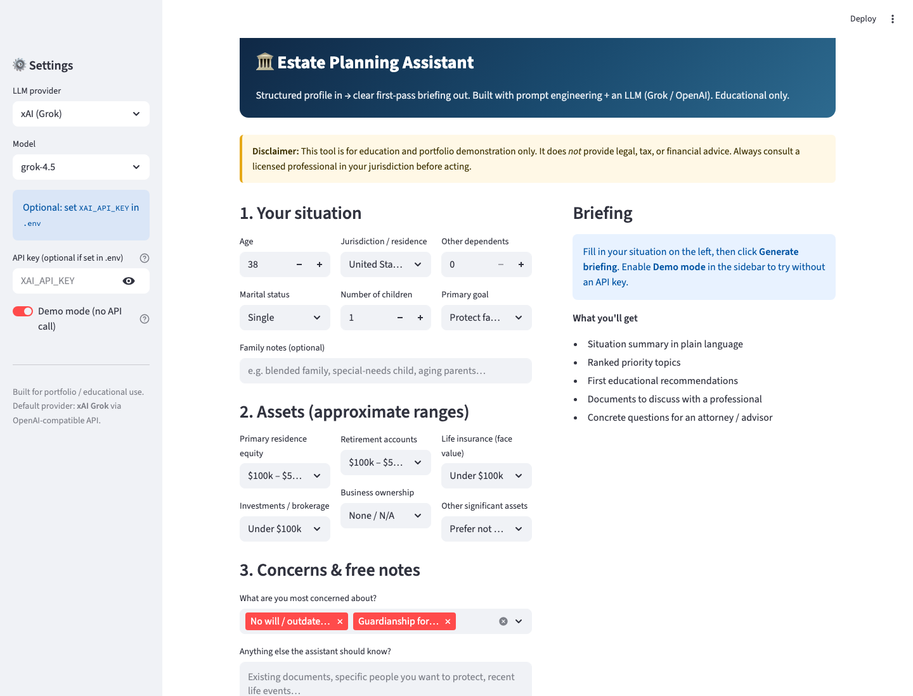
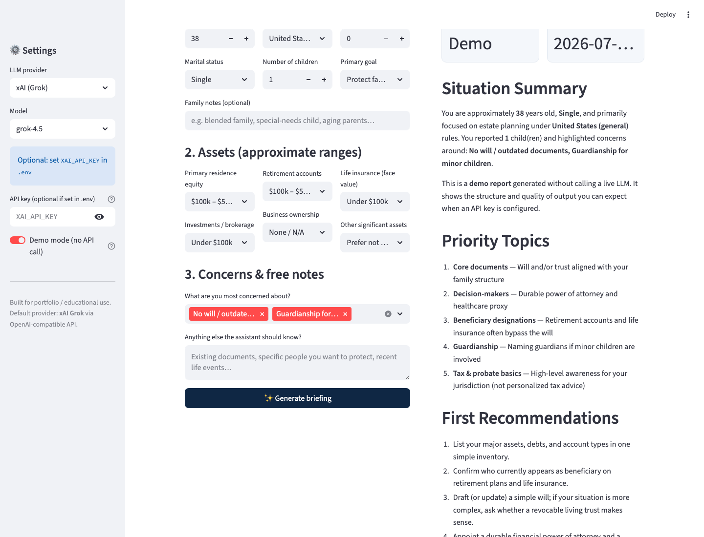

# Estate Planning Assistant

A small but polished **LLM-powered Streamlit app** that turns a structured family/asset profile into a **first-pass estate planning briefing**.

Built as a portfolio project (relevant for wealth-tech / fintech roles): clear UX, careful prompt engineering, multi-provider LLM support, and an offline demo mode.

> **Not legal, tax, or financial advice.** Educational and demonstration use only. Always consult a licensed professional in your jurisdiction.

---

## Why this project

Wealth and estate platforms need more than raw chat. This app shows:

| Skill | How it shows up |
| --- | --- |
| **LLM product thinking** | Structured intake → constrained system prompt → consistent briefing sections |
| **Practical AI engineering** | OpenAI-compatible client, env-based secrets, demo fallback without API |
| **UX for sensitive topics** | Clear disclaimer, plain-language output, downloadable report |
| **Ship-ready hygiene** | README, `.env.example`, `.gitignore`, modular package layout |

---

## Features

- **Structured intake form** — age, marital status, jurisdiction, children, asset ranges, concerns
- **Prompt-engineered briefing** with fixed sections:
  - Situation Summary  
  - Priority Topics  
  - First Recommendations  
  - Documents & Instruments to Discuss  
  - Questions for a Professional  
  - Missing Information  
  - Disclaimer  
- **Providers:** xAI Grok (default) or OpenAI  
- **Demo mode** — full sample report without any API key (great for screenshots & interviews)  
- **Markdown download** of the generated briefing  

---

## Screenshots

### 1 · Intake form



### 2 · Generated briefing (demo mode)



---

## Quick start

### 1. Clone & install

```bash
cd estate-planning-assistant
python3 -m venv .venv
source .venv/bin/activate   # Windows: .venv\Scripts\activate
pip install -r requirements.txt
```

### 2. Configure API key (optional)

```bash
cp .env.example .env
# edit .env → set XAI_API_KEY=...
```

Get an xAI key: [console.x.ai](https://console.x.ai) · Docs: [docs.x.ai](https://docs.x.ai)

No key? Enable **Demo mode** in the sidebar.

### 3. Run (easiest)

```bash
./start.sh
```

Or manually:

```bash
source .venv/bin/activate
streamlit run app.py
```

Opens at [http://localhost:8501](http://localhost:8501).

> **Do not** run with system Python (`python3 app.py` / `/usr/bin/python3 app.py`) — Streamlit lives in the project `.venv`.

---

## Project structure

```text
estate-planning-assistant/
├── app.py                      # Streamlit UI
├── estate_assistant/
│   ├── __init__.py
│   ├── prompts.py              # System + user prompt templates
│   ├── llm.py                  # Provider config + generation
│   └── demo.py                 # Offline demo report
├── assets/                     # Screenshots for README
├── requirements.txt
├── .env.example
└── README.md
```

---

## How the LLM call works

1. The UI collects a **structured profile** (not free-form chat only).
2. `prompts.py` builds a system prompt that:
   - forces educational tone and a fixed section layout  
   - forbids fake statute citations  
   - always ends with a disclaimer  
3. `llm.py` calls the selected provider via the **OpenAI-compatible** API:

```python
client = OpenAI(api_key=api_key, base_url="https://api.x.ai/v1")
response = client.chat.completions.create(
    model="grok-4.5",
    messages=[
        {"role": "system", "content": SYSTEM_PROMPT},
        {"role": "user", "content": build_user_prompt(profile)},
    ],
)
```

Default model: **`grok-4.5`** (xAI). OpenAI models are available as an alternative in the sidebar.

---

## Example use (for demos / interviews)

1. Age 38, married, 1 child, California  
2. Concerns: outdated documents, guardianship  
3. Assets in mid ranges  
4. Click **Generate briefing** (or use Demo mode)  
5. Download the Markdown report  

---

## Security notes

- API keys via environment / sidebar only — never hard-coded  
- `.env` is git-ignored  
- No user data is stored by the app (session only)

---

## Tech stack

- Python 3.9+  
- [Streamlit](https://streamlit.io)  
- [OpenAI Python SDK](https://github.com/openai/openai-python) (xAI-compatible base URL)  
- `python-dotenv`  

---

## Possible extensions

- LangChain chain with memory / multi-turn Q&A  
- PDF export of the briefing  
- RAG over public estate-planning education material  
- Structured JSON output + evaluation harness  
- Multi-language UI (EN / DE)

---

## License

MIT — use freely for portfolio and learning. Do **not** present outputs as professional advice.
